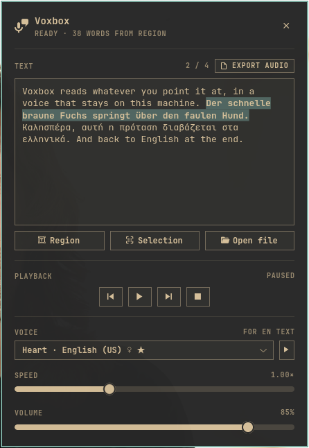

# Voxbox

Reads anything on your screen aloud. 100% offline — no cloud, no accounts, no
privacy concerns.



- Drag a box over anything on screen → OCR → speech
- Read your text selection, or a PDF / EPUB / txt / HTML file
- 51 languages offline, auto-detected per sentence — mixed-language text just works
- Export to MP3 / WAV / FLAC / OGG
- Omarchy shell plugin (bar widget + native panel) and standalone GTK4 app
- Follows your Omarchy theme, live

## Install

Omarchy plugin:

```bash
omarchy plugin add https://github.com/nousd/voxbox.git --enable
~/.config/omarchy/plugins/io.github.nousd.voxbox/install.sh   # speech engine, ~600 MB, once
```

Bar icon: **click** — panel · **right-click** — capture a region · **middle** — play/pause.
Optional keybinding: `o.bind("SUPER + SHIFT + R", "Voxbox", "omarchy-shell voxbox toggle")`

Standalone (any Wayland desktop):

```bash
git clone https://github.com/nousd/voxbox.git && cd voxbox && ./install.sh
```

System packages (Arch):

```bash
sudo pacman -S --needed python python-gobject gtk4 libadwaita ffmpeg \
  grim slurp hyprpicker tesseract tesseract-data-eng wl-clipboard poppler
```

More languages — voice and OCR data, no root:

```bash
voxbox-add-language el de      # no arguments lists all 43
```

## Standalone app keys

`Super+Shift+R` panel · `Super+Alt+V` region · `Super+Alt+T` selection · `Super+Alt+P` play/pause.
Inside: `Space` play/pause · `←/→` skip · `Ctrl+R/V/O/E` region/selection/open/export · `Esc` hide.
The text is editable — fix an OCR slip and it re-reads.

## Uninstall

```bash
./uninstall.sh          # --purge removes settings too
```

Built on [kokoro-onnx](https://github.com/thewh1teagle/kokoro-onnx),
[piper](https://github.com/OHF-Voice/piper1-gpl),
[lingua](https://github.com/pemistahl/lingua-py) and
[tesseract](https://github.com/tesseract-ocr/tesseract). MIT — see [LICENSE](LICENSE).
